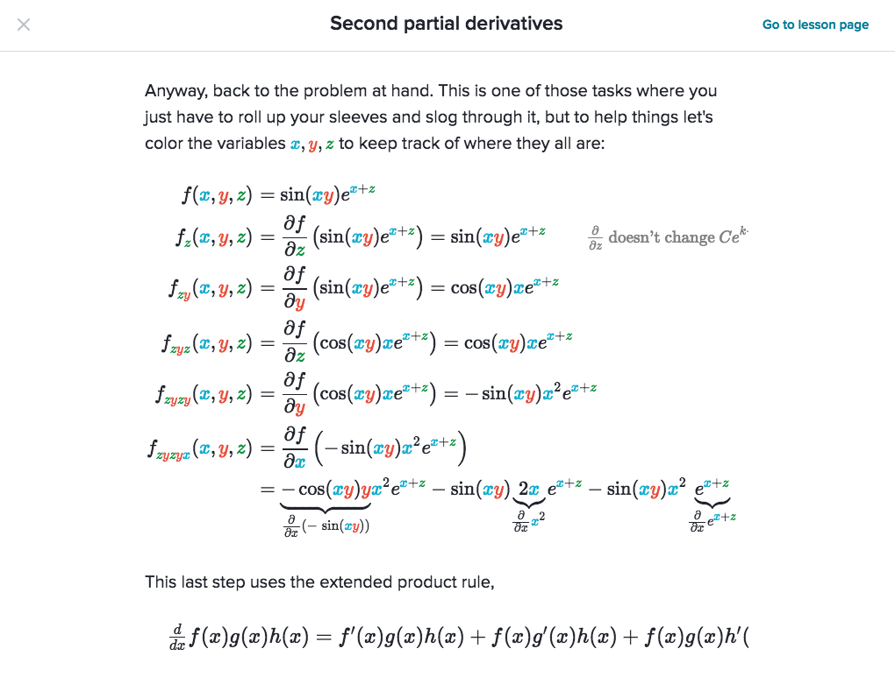

# Derivatives of multivariable functions
> 

## 3. Partial derivative and gradient
> A multivariable function is just a function whose input and/or output is made up of multiple numbers. In contrast, a function with single-number inputs and a single-number outputs is called a single-variable function.

### Second partial derivatives
> Technically, the symmetry of second derivatives is not always true. There is a theorem, referred to variously as Schwarz's theorem or Clairaut's theorem, which states that symmetry of second derivatives will always hold at a point if the second partial derivatives are *continuous* around that point. To really get into the meat of this, we'd need some real analysis.

